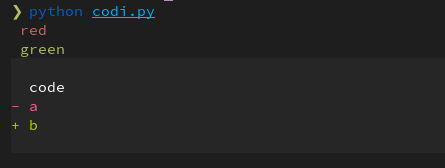

# test

## the code
``` python
--8<-- "codi.py"
```

## the screenshot in the terminal



## using markdown-exec

```bash exec="1" result="ansi"
export FORCE_COLOR=1
python codi.py

```

What is the reason for the missing colors in the diff?

red and green in the diff are important for me. The correct background color would be nice, but is not so important.


